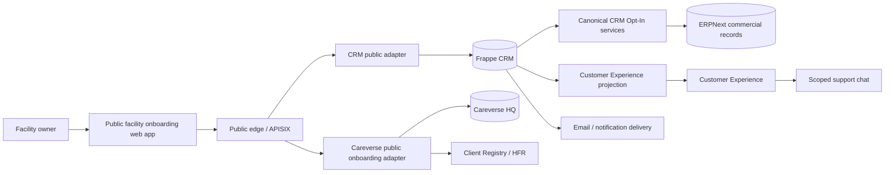
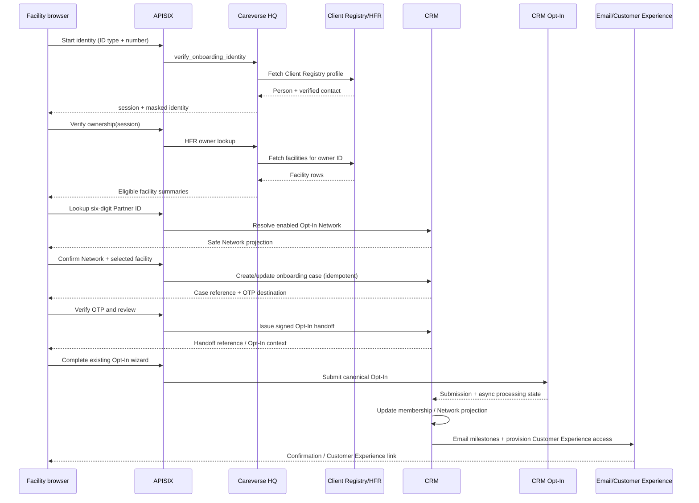

# External Handoff Architecture — Facility Onboarding and Customer Experience

**Audience:** CRM frontend/backend, Careverse HQ, and APISIX/integration
**Status:** Proposed baseline

## 1. System context



### Ownership

| Capability | Owner | Source of truth |
|---|---|---|
| Public Network Partner ID and Network binding | CRM | `CRM Opt-In Network.partner_id` |
| Identity and HFR ownership proof | Careverse HQ | Client Registry/HFR response + redacted case evidence |
| Facility creation and facility operational data | Careverse HQ | `Health Facility`, Careverse onboarding queue |
| Facility onboarding case orchestration | CRM, with Careverse evidence | Proposed `CRM Facility Onboarding Case` |
| Pricing, terms, signature, Opt-In submission | CRM | Existing Opt-In services/documents |
| Membership relationship and Network menu | CRM | `CRM Facility Membership` + existing menu projection |
| Customer-safe progress view | CRM read projection | Case + downstream lifecycle records |
| Chat | CRM/support integration | Conversation/thread records |

## 2. Boundary rules

- The external team calls APISIX/public adapters only. It never calls Frappe
  `/api/resource` or internal `/api/method` routes directly.
- CRM resolves the six-digit Partner ID → Opt-In Network server-side.
- Careverse returns verified facility ownership facts; it does not decide CRM
  membership, price, quote, contract, or Opt-In completion.
- CRM invokes the existing Opt-In service rather than reproducing it in
  Customer Experience.
- Every write carries `X-Correlation-Id` and `Idempotency-Key`.
- Every projection is allow-listed and customer-safe; raw documents are never
  serialized as a convenience.

## 3. Recommended request path

```text
Browser
  → APISIX route
  → CRM/Careverse adapter
  → domain service
  → Frappe document(s) / upstream HFR
  → normalized public response
```

APISIX should enforce TLS, origin policy where applicable, request size,
rate-limits, correlation IDs, and token validation. Frappe remains responsible
for business authorization and document permissions.

## 4. Cross-app sequence: facility self-onboarding



The exact browser sequence may use separate public origins for Careverse and
CRM, but the external frontend should see one stable orchestration API.

## 5. Public API surface for the external team

The following is a product-level contract for the public facility journey and
the authenticated Customer Experience projection.

| Operation | Method | Purpose |
|---|---:|---|
| `get_public_network` | GET | Resolve an enabled six-digit Partner ID to safe Network branding and copy |
| `create_facility_onboarding_session` | POST | Start identity/HFR session or return resumable case reference |
| `verify_facility_identity` | POST | Careverse identity verification |
| `verify_facility_ownership` | POST | HFR ownership lookup for verified session |
| `confirm_network_for_case` | POST | Bind case to the resolved Network and selected HFR facility |
| `send_case_otp` / `verify_case_otp` | POST | Prove contact control |
| `get_case_review` | GET | Return safe review projection |
| `create_optin_handoff` | POST | Produce short-lived signed reference into canonical Opt-In |
| `get_onboarding_status` | GET | Read case + downstream customer-safe progress |
| `resume_onboarding` | POST | Resume with secure reference/email link |
| `send_customer_message` | POST | Write a facility-scoped Customer Experience message |

### Public Network projection

```json
{
  "partner_id": "123456",
  "network": {
    "display_name": "Rafiki Health Network",
    "logo_url": "https://...",
    "primary_colour": "#..."
  },
  "support": { "email": "support@example.org" },
  "onboarding_copy": "...",
  "status": "enabled"
}
```

### Case projection

```json
{
  "reference": "FOC-2026-000184",
  "status": "optin_pending",
  "source": "public",
  "network_partner_id": "123456",
  "network": { "display_name": "Rafiki Health Network" },
  "facility": {
    "hfr_id": "...",
    "facility_code": "1048",
    "name": "Rafiki West Clinic",
    "verification": "hfr_verified"
  },
  "progress": {
    "current": "Opt-In",
    "steps": [
      { "key": "identity", "status": "complete" },
      { "key": "facility", "status": "complete" },
      { "key": "network", "status": "complete" },
      { "key": "optin", "status": "current" },
      { "key": "implementation", "status": "locked" }
    ]
  },
  "next_action": { "key": "complete_optin", "label": "Continue to Opt-In" }
}
```

### Error envelope

Use stable codes and safe messages:

```json
{
  "error": {
    "code": "NETWORK_DISABLED",
    "message": "This Network is not accepting new facilities right now.",
    "retryable": false,
    "details": { "support_reference": "SUP-..." }
  },
  "meta": { "request_id": "...", "correlation_id": "...", "api_version": "facility-onboarding.v1" }
}
```

Suggested codes: `IDENTITY_NOT_FOUND`, `IDENTITY_INCOMPLETE`,
`HFR_UNAVAILABLE`, `NO_FACILITIES_FOUND`, `FACILITY_ALREADY_ONBOARDED`,
`PARTNER_ID_NOT_FOUND`, `NETWORK_DISABLED`, `FACILITY_NETWORK_REVIEW_REQUIRED`,
`OTP_INVALID`, `SESSION_EXPIRED`, `OPTIN_HANDOFF_EXPIRED`, `DUPLICATE_REQUEST`,
and `SUPPORT_REQUIRED`.

## 6. Authentication and authorization

### Public onboarding

- Guest access is limited to the public guide, Network Partner ID lookup, and
  stage-specific verification endpoints.
- The server-issued session is opaque, short-lived, rate-limited, and bound to
  the identity hash; browser state is not authorization.
- OTP is required before sensitive contact/case handoff.
- The signed Opt-In handoff is audience-, Network-, case-, and expiry-bound.

### Customer Experience

- Provision a dedicated least-privilege Website User. Do not grant the
  existing broad `Facility Admin` role merely to provide read-only progress.
- Bind the user to the onboarding case and verified facility/membership.
- Chat writes are the only MVP mutation after login.

## 7. Idempotency and consistency

Idempotency is required for:

- HFR verification retries.
- Customer Experience case creation.
- OTP send/resend requests.
- Opt-In handoff issuance.
- Opt-In submission.
- Admin invitation creation.

Same key + same normalized payload returns the original response. Same key +
different payload returns `409 DUPLICATE_REQUEST`. HFR and CRM failures must
not create a partial active membership. Outbox/event or queue processing should
reconcile case, membership, submission, and Customer Experience provisioning after a timeout.

## 8. Five-year pricing architecture

```text
CRM Opt-In Network.partner_id
    → Network price configuration (Year 1 … Year 5)
    → Opt-In pricing service
    → versioned pricing snapshot on CRM Opt-In Submission
```

The existing CRM pricing helpers and Opt-In APIs remain the calculation
authority. Customer Experience receives a projection only. If the current
`CRM Opt-In Network` configuration is stored as a JSON bundle, expose a typed
  projection/version to Customer Experience and validate all five years before
  a Network is enabled.

## 9. Event and notification model

Emit redacted lifecycle events for:

- `facility_identity_verified`
- `facility_ownership_verified`
- `network_confirmed`
- `facility_case_created`
- `optin_started`
- `optin_submitted`
- `optin_processing_failed`
- `facility_opted_in`
- `implementation_started`
- `implementation_milestone_updated`
- `customer_experience_access_issued`
- `chat_message_received`

Email is the primary customer journey channel. Customer Experience is a visibility
surface, not the sole source of truth. Notifications should be deduplicated by
case, event, recipient, and template version.

## 10. Repository handoff map

### CRM app

| Area | Proposed location |
|---|---|
| Partner ID fields/validation | `crm/fcrm/doctype/crm_opt_in_network/` + migration/patch |
| Onboarding case | `crm/fcrm/doctype/crm_facility_onboarding_case/` |
| Public adapter | `crm/api/facility_onboarding_portal.py` |
| Network CRUD UI | `frontend/src/pages/Networks/` and existing CRM resource patterns |
| Opt-In handoff | Existing `crm.api.optin` services, wrapped by a signed handoff service |
| Progress projection | `crm/api/lifecycle.py` / new customer-safe projection service |
| Permission tests | `crm/tests/` for cross-Network and cross-case isolation |

### Careverse HQ app

| Area | Existing baseline / proposed extension |
|---|---|
| Identity | `careverse_hq/api/public_facility_login_onboarding.py` |
| HFR owner lookup | `careverse_hq/api/facility_admin_registration.py` |
| HFR facility details | `careverse_hq/api/facility_onboarding_v2.py` |
| Queued facility creation | `Facility Onboarding Queue` and public onboarding helpers |
| CRM handoff | New signed outbound adapter/job; no CRM pricing/membership logic |
| Customer Experience account | Reconcile current Website User provisioning with the read-only projection |

### External frontend

Implement against the projections and state machine here, using the existing
CRM `frappe-ui`/Tailwind visual language. The frontend must not import Frappe
DocType names as its public domain model.

## 11. Verification plan

- Contract tests for every public projection and stable error code.
- Unit tests for six-digit Partner ID generation, supplied-ID validation,
  uniqueness, immutability, and enabled-Network lookup.
- Careverse tests for identity/HFR/session stage transitions and rate limits.
- Cross-app integration tests for correlation, idempotency, timeout/retry, and
  duplicate Opt-In submission.
- Authorization tests proving no cross-Network, cross-facility, or raw PII
  leakage.
- Browser tests for mobile wizard, resume, HFR error, invalid Partner ID,
  session expiry, accessible status announcements, and the Opt-In terminal CTA.
- Visual regression for the public wizard and Customer Experience in
  light/dark themes where supported by the CRM app.

## 12. Recommended implementation order

### Foundation sequence

1. Add Network-owned six-digit Partner ID generation, supplied-ID override,
   backfill, and customer-safe lookup.
2. Add public Network lookup and customer-safe projections.
3. Wrap the existing Careverse session/HFR flow behind the cross-app case API.
4. Create the CRM onboarding case and idempotent handoff.
5. Reuse the existing Opt-In wizard with a signed prefill context.
6. Reconcile membership/Network menu updates and five-year pricing preflight.

### Active completion sprint

7. Complete the canonical OIS and all applicable Contract Signatory rows.
8. Create/reconcile the Website User and OIS User Permission after processing.
9. Expose a permission-bound Customer Experience progress projection. Resolve
   GoLive from `CRM Facility Membership.go_live` for each facility/network
   contact; never derive it from a browser parameter or a generic Contact row.
10. Render `/cx-portal` progress and next action in Vue. Keep `/portal` as a
    compatibility alias only.
11. Test invitation idempotency, stale permissions, cross-OIS access,
    multi-facility submissions, signature progress, membership status, and
    GoLive projection.

### Follow-on commercial and support sequence

12. Add Customer Experience read actions for token package search, open orders, invoices,
    and the existing Paystack Checkout path.
13. Add chat, email milestones, analytics, and hardening.
14. Harden rate limits, retention, observability, accessibility, and recovery.

The active sprint does not introduce a second membership or GoLive model. Its
output is a customer-safe projection over the existing OIS, Contract,
`CRM Facility Membership`, and User Permission records.
