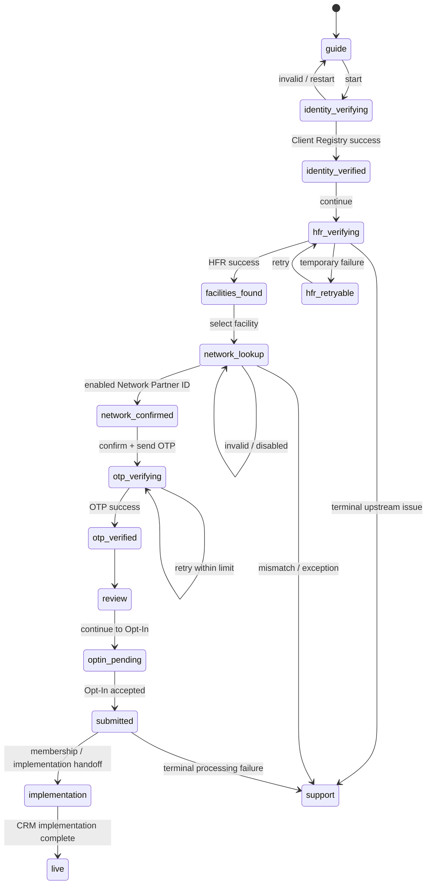

# UI/UX and Component Map — Facility Onboarding and Customer Experience

**Design source:** CRM Vue 3 + `frappe-ui` and the existing public Opt-In
wizard.
**Primary UX goal:** a high-confidence, mobile-first wizard that turns a
verified facility owner into a completed Opt-In and a clear Customer Experience
view without exposing CRM complexity.

**Implementation status — 2026-10-08:** the public landing page is `/`, the
facility-owner welcome and wizard is `/facility-onboarding`, and the
authenticated surface is `/cx-portal`. The public landing and onboarding
welcome are implemented; resume-by-reference, scoped support chat, and the
downstream purchase/payment experiences remain separate stories.

## 1. Design language

Reuse the existing CRM/Opt-In visual grammar:

- `frappe-ui` controls and resource loading conventions.
- Neutral gray page canvas, white bounded cards, subtle borders, and restrained
  shadows.
- Network brand color as the accent, with accessible semantic success,
  warning, and error treatments.
- Rounded cards and buttons used consistently with `OptInWizard.vue` and its
  `Step*` components.
- Compact progress indicator, clear step title, supporting explanation, and a
  single primary CTA.
- `frappe-ui` typography and surface tokens for the authenticated workspace;
  avoid introducing a second token system.

The facility journey may feel more guided than the current Opt-In wizard, but
it must still look like the same product family.

## 2. Information architecture

```text
Public
├── /
│   ├── Customer Experience overview
│   ├── Onboarding journey and requirements
│   └── Start onboarding / Customer Experience sign-in
├── /facility-onboarding
│   ├── Welcome / what you need
│   ├── Verify identity
│   ├── Confirm HFR facilities
│   ├── Enter Network Partner ID
│   ├── Confirm Network
│   ├── Confirm contact / OTP
│   ├── Opt-In handoff
│   └── Submitted / next steps
├── /facility-onboarding/resume/:reference (planned)
Authenticated
├── /cx-portal (Customer Experience)
│   ├── Overview
│   ├── My facilities / cases
│   ├── Facility journey detail
│   ├── Messages
│   └── Account / notification preferences

CRM internal
├── Opt-In Networks and Partner IDs
├── Network detail
├── Facility onboarding cases
└── Network menu / Opt-In submissions
```

## 3. Facility wizard component map

| Component | Responsibility | Inputs | Remote state | Exit condition |
|---|---|---|---|---|
| `FacilityOnboardingShell` | Layout, brand, session expiry, responsive card | Network context, resume ref | loading/error/session expired | Child emits next/back/restart |
| `OnboardingGuide` | Explains why verification is needed and what to prepare | Copy, support contact | none | `Start onboarding` |
| `IdentityStep` | ID type/number, privacy note, validation | ID types, draft value | verifying/invalid/unavailable | Server returns session + masked identity |
| `HfrFacilitiesStep` | Presents verified facility cards and mismatch action | HFR facility summaries | loading/empty/retry | One or more eligible facilities selected |
| `NetworkPartnerIdStep` | Network Partner ID input or invitation-bound confirmation | Invitation context, draft code | lookup/not found/disabled | Enabled Network resolved |
| `NetworkConfirmationCard` | Make the Network binding explicit and trustworthy | Public Network projection | none | User confirms correct Network |
| `ContactAndOtpStep` | Confirm delivery channel and prove control | Masked email/phone | sending/verifying/resend cooldown | OTP verified |
| `OnboardingReviewStep` | Review identity, facilities, Network, source | Case projection | saving | Handoff is accepted |
| `OptInHandoff` | Transfers context into existing Opt-In wizard | Signed handoff/reference | loading/expired | Existing `OptInWizard` mounts |
| `SubmissionProgress` | Shows async Opt-In steps and safe retry | Submission reference | polling/retry/failure | Completed or support-needed |
| `OnboardingComplete` | Explains email/Customer Experience access and next action | Case/status projection | none | Customer Experience/email CTA |

### Supporting primitives

| Primitive | Use |
|---|---|
| `JourneyProgressBar` | Numbered stages with completed/current/locked states |
| `StepHeader` | Eyebrow, title, explanation, “What happens next” |
| `AsyncStatePanel` | Loading, retryable upstream error, terminal error |
| `VerifiedFact` | HFR/identity fact with source label and last checked time |
| `StatusBadge` | Accessible text + icon; never color alone |
| `MaskedDestination` | OTP destination with change/support action |
| `ResumeBanner` | Saved reference, expiry, and resume link/email state |
| `SupportPrompt` | Safe route to support without exposing internals |

## 4. Customer Experience component map

| Component | Responsibility |
|---|---|
| `CustomerExperienceShell` | Single-facility or facility-picker context |
| `WelcomeCard` | Friendly summary and current stage |
| `ProgressStepper` | Identity → Opt-In → implementation → live |
| `NextActionCard` | One recommended action, owner, and help link |
| `MilestoneTimeline` | Customer-safe status history |
| `NetworkContactProgress` | Facility/network membership status and the authoritative `CRM Facility Membership.go_live` state |
| `DocumentStatusList` | Requested/received/approved state; no internal notes |
| `ChatThread` | Message thread, unread marker, response expectation |
| `EmailFallbackCard` | Explains that email remains authoritative |

## 5. Step-by-step UX specification

### Step 0 — Guide

Headline: “Join your healthcare facility to the right Network.”

Show three illustrated facts:

1. We verify your identity.
2. We confirm the facilities linked to you in the Health Facility Registry.
3. We connect the facility to the right Network and complete Opt-In.

Show a “You’ll need” card: identification document, facility details, Network Partner
ID, access to verified email/phone. Keep the main CTA above the fold on mobile.

### Step 1 — Identity

Use a two-field form with inline guidance. On submit, lock the form and show a
specific progress message: “Checking your identity securely.” On success show
masked name only and explain the next HFR step. On failure distinguish:

- “We couldn’t find a matching profile.”
- “Your profile needs an email/phone before you can continue.”
- “Verification is temporarily unavailable. Try again.”

Never echo the submitted ID in the error or URL.

### Step 2 — HFR facilities

Render each facility as a selectable card:

```text
[ ] Rafiki West Clinic                 HFR verified
    Facility ID: 1048                  Nairobi · Private
    Registry status checked just now
```

Separate eligible, already onboarded, and needs-review groups. A mismatch
action opens a small explanation/support panel; it does not let the user edit
HFR facts into a facility record.

### Step 3 — Network Partner ID

The input accepts the six-digit Network Partner ID and optionally a QR deep
link. After lookup, show the Network confirmation card before proceeding:

```text
You are joining
Rafiki Health Network

[logo]  Network Partner ID: 123456
        Network support: support@example.org
```

For an invitation link, show “Your invitation is for this Network” and hide
the editable code unless the user chooses “I have a different Partner ID.”

### Step 4 — Contact and OTP

Use the verified Client Registry contact as the default. Allow correction only
through the defined support/update path; do not silently replace verified
identity data with arbitrary input. Make resend cooldown and attempt count
visible, with accessible live announcements.

### Step 5 — Review and handoff

Use stacked review cards with Edit links:

- Your verified identity (masked)
- Facility selected from HFR
- Network and Partner ID
- Contact and delivery channel
- What happens after Opt-In

The primary CTA should say **Continue to Opt-In**. This language makes the
terminal flow visible and avoids suggesting that the case is already complete.

### Step 6 — Existing Opt-In

Mount/reuse the existing CRM `OptInWizard` with a signed, short-lived handoff
reference. Prefill known contact/facility/Network data, but keep the existing
terms, pricing, signatory, witness, and async submit semantics. The user must
see the Year 1–Year 5 schedule before committing.

### Step 7 — Submitted

Show the submission reference, current state, email expectation, and Customer
Experience
access explanation. If processing is asynchronous, use a progress view that
states what is happening and what the user can safely do next. Never encourage
duplicate submission while a job is active. Once the user is authenticated,
show one Network Contact progress card per facility. The card must include
membership status and GoLive readiness; GoLive is read-only for the facility
owner and comes from the CRM membership record.

## 6. State model



## 7. Responsive wireframes

### Desktop

```text
┌──────────────────────────────────────────────────────────────┐
│ Network logo                                 Need help?      │
├───────────────┬──────────────────────────────────────────────┤
│ 1 Identity ✓  │ Step title                                   │
│ 2 Facilities  │ Explanation                                  │
│ 3 Network ID  │ ┌──────────────────────────────────────────┐ │
│ 4 Confirm     │ │ Form / verified cards / review content   │ │
│ 5 Opt-In      │ └──────────────────────────────────────────┘ │
│               │ Back                         Continue        │
└───────────────┴──────────────────────────────────────────────┘
```

### Mobile

```text
┌──────────────────────────┐
│ Logo              Help    │
│ ●──○──○──○──○  2 of 5    │
│ Confirm your facilities   │
│ Short explanation         │
│                          │
│ [facility card]           │
│ [facility card]           │
│                          │
│ [Continue]                │
│ Back                      │
└──────────────────────────┘
```

On mobile, the stepper becomes a compact progress bar plus “2 of 5”; do not
force a horizontal scroll.

## 8. Error and empty states

| Condition | User-facing treatment | Recovery |
|---|---|---|
| No HFR facilities | “No facilities were found for this identity.” | Check ID, contact support |
| HFR unavailable | “The registry is temporarily unavailable.” | Retry; preserve session |
| All facilities already onboarded | List masked facility names and explain access path | Sign in / contact support |
| Invalid Partner ID | “Check the six-digit code or ask the administrator to resend the invitation.” | Edit/retry |
| Disabled Network | “This Network is not accepting new facilities right now.” | Choose another enabled ID / support |
| HFR/CRM mismatch | “We need to review this facility before it can continue.” | Create support case |
| Session expired | “For your security, this session expired.” | Restart; preserve no sensitive fields in URL |
| Duplicate submit | Show existing reference and current progress | Resume progress |

## 9. Frontend ownership and handoff

The external frontend team owns presentation and local state orchestration. CRM
and Careverse own validation, authorization, pricing resolution, state
transitions, and side effects.

The frontend team should receive:

- The public projection schemas, never raw Frappe documents.
- The state machine and allowed transitions above.
- Stable error codes and safe messages.
- Brand/config payload from the resolved Network.
- A signed Opt-In handoff reference, not internal IDs or credentials.
